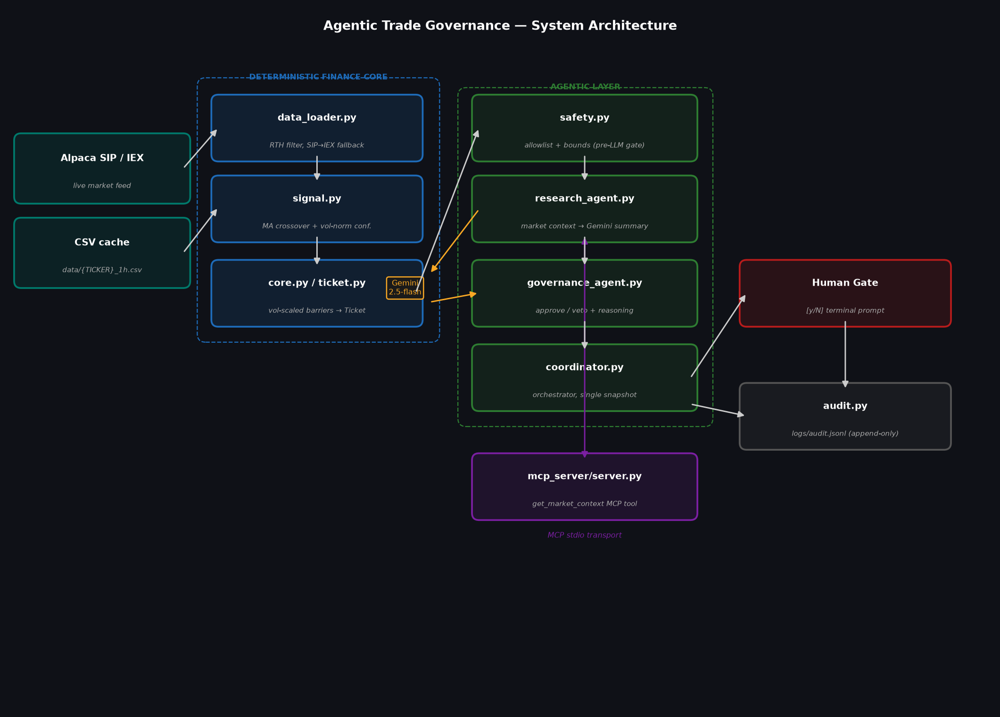

# Agentic Trade Governance

An agentic risk-governance system for algorithmic trading: a deterministic finance core proposes trades, LLM agents reason about them, and a human always has the final gate.

---

## The Problem

Algorithmic trading systems generate trade decisions from quantitative signals, but a raw signal cannot reason about its own context. A moving-average crossover does not know that it fired at the recent high of a volatile session, that its confidence score is poorly calibrated, or that the implied stop-loss sits inside the typical noise of a single hourly bar. Those failures are precisely what a human risk officer catches by reading the market context alongside the trade parameters.

This gap is well-known in production trading. Risk teams use pre-trade checklists, independent risk systems, and mandatory human sign-off for a reason: the signal model is optimized to generate signals, not to assess whether today is a good day to act on one. LLM agents are well-suited to fill this interpretive role: they can read a structured set of numbers, apply general financial reasoning, and explain their concerns in plain language. They are not suited to compute the numbers themselves.

This project builds a governance layer between the signal and execution. The deterministic finance core handles all exact computation. The agentic layer handles all judgment. A human handles the final approval. The line between code and LLM is strict by design.

---

## The Solution: Architecture

### Two-Layer Design

**Deterministic Finance Core** (`finance_core/`)

The finance core loads hourly OHLCV bars, computes a moving-average crossover signal, and produces a `Ticket`: a fully specified trade proposal with entry, stop, target, size, and confidence. No LLM is involved at any point. All numbers are computed by code and are reproducible given the same input data. Nothing is guessed. Nothing is approximated.

Key design choices in the core:
- Confidence is volatility-normalized: `ma_separation / recent_hourly_vol`, scaled to a `[0, 0.85]` range. A strong crossover in a calm market scores higher than the same crossover in a volatile one.
- Stop and target distances are volatility-scaled: stop = 2x recent hourly volatility, target = 2x stop, preserving a 2:1 reward/risk ratio. Fixed basis-point barriers were too narrow for hourly volatility (a story told in the Findings section).
- A confidence breakdown dict travels with the ticket so every agent can see exactly how the score was computed, without re-deriving it.

**Agentic Layer** (`agentic_layer/`)

The agentic layer receives the ticket and reasons about it. Agents read numbers; they do not produce them. Gemini (`gemini-2.5-flash`) is used for LLM calls.

The flow through the agentic layer is enforced by the coordinator in strict order:

1. **Safety validation** (`safety.py`): structural checks on the ticket before any Gemini quota is spent. Ticker allowlist, stop/target side checks, confidence bounds, $500 hard dollar-risk cap. Deterministic code, not LLM reasoning, because safety checks must be reliable.

2. **Research agent** (`research_agent.py`): fetches market context via an MCP tool call, then asks Gemini to interpret the numbers as a concise analyst note. The agent flags conditions worth watching: high volatility, price at the recent high, thin volume.

3. **Governance agent** (`governance_agent.py`): receives the ticket and the research report, asks Gemini to approve or veto with explicit reasoning and structured flags. The prompt includes the full confidence breakdown and the dynamic volatility-scaled barrier distances so Gemini reasons about the actual parameters, not generic ones.

4. **Human gate** (`coordinator.py`): the governance decision is presented to the human alongside the dollar risk, research concerns, and governance flags. The human types `y` or `N`. That is the entire interface. Governance "approved" does not auto-execute. The human is always the final gate.

5. **Audit log** (`audit.py`): every run appends a JSON record to `logs/audit.jsonl`, capturing all fields from all stages, the human decision, and any errors. The log writes in a `finally` block so it fires even on crashes.

### ASCII Flow Diagram

```
 Alpaca SIP/IEX                  DETERMINISTIC FINANCE CORE
 ─────────────                   ──────────────────────────
  market feed ──────────────────► data_loader.py  (RTH filter, SIP→IEX fallback)
  CSV cache   ──────────────────►      │
                                       ▼
                                  signal.py  (MA crossover, vol-normalized conf.)
                                       │
                                       ▼
                                  core.py / ticket.py  (vol-scaled barriers → Ticket)
                                       │
                                       │  Ticket
                                       ▼
                         AGENTIC LAYER
                         ─────────────
                          safety.py  <── allowlist + bounds (hard gate, no LLM)
                               │ pass
                               ▼
                          research_agent.py
                               │  MCP call
                               ▼
                    mcp_server/server.py
                    (get_market_context MCP tool)
                               │  metrics dict
                               ▼
                          research_agent.py (cont.)
                               │  Gemini summary
                               ▼
                          governance_agent.py  (approve/veto via Gemini)
                               │
                               ▼
                          coordinator.py  (orchestrator, single snapshot)
                               │
                          ┌────┴────┐
                          ▼         ▼
                     Human Gate   audit.py
                     [y/N] prompt  logs/audit.jsonl
```

### Architecture Diagram



---

## Course Concepts Demonstrated

### 1. Multi-Agent System

Three agents with distinct roles and a strict separation of authority, orchestrated by the coordinator.

| Agent | File | Role |
|---|---|---|
| Research agent | `agentic_layer/research_agent.py` | Fetches market context, produces analyst summary and concern list |
| Governance agent | `agentic_layer/governance_agent.py` | Approves or vetoes the ticket with structured reasoning and flags |
| Coordinator | `agentic_layer/coordinator.py` | Enforces stage order, single data snapshot, and the human gate |

The research agent's output (summary, concerns) is passed directly into the governance agent's prompt, so governance reasons about market conditions alongside the trade parameters. Neither agent computes numbers: the coordinator passes the pre-loaded bar DataFrame to every stage to avoid temporal drift between calls.

### 2. MCP Server

The market-context computation is exposed as a typed MCP tool via a stdio-transport MCP server.

| File | Role |
|---|---|
| `mcp_server/server.py` | Stdio MCP server. Registers `get_market_context` with a JSON schema; accepts `ticker` and optional `as_of`; returns the full metrics dict as JSON. |
| `mcp_server/client.py` | Standalone MCP client (Python 3.11). Called as a subprocess by the research agent; connects to the server over stdio, calls the tool, writes JSON to stdout. |
| `agentic_layer/research_agent.py` | Calls `python3.11 -m mcp_server.client TICKER` via subprocess; parses the JSON result; logs `"MCP tool called: get_market_context"` on success. Falls back to the direct import if the subprocess fails. |

The MCP architecture means that any other MCP-speaking agent (a portfolio agent, a reporting agent, an external system) could call `get_market_context` without importing Python code directly. The tool is self-describing: its parameter schema and description are announced at connection time. Any MCP client can discover it.

**Note on the Python version split:** the `mcp` package requires Python 3.10+. The rest of the project runs on Python 3.9 (macOS system Python). The server and client run as subprocesses under Python 3.11 (Homebrew); the coordinator runs under Python 3.9. They communicate over subprocess stdio. This is standard MCP architecture: the server and client are separate processes and can use different runtimes.

### 3. Security Features

Three independent security layers, each handling a different threat:

**Allowlisting and bounded values** (`agentic_layer/safety.py`):

Before any Gemini call, `validate_ticket()` runs six structural checks: ticker in the allowlist, positive integer size, stop on the correct side of entry, target on the correct side of entry, confidence in `[0, 1]`, and dollar risk under `$500`. Any violation aborts the workflow immediately. These checks use deterministic code because safety invariants must not depend on LLM reasoning, which is probabilistic and can misread numbers.

```python
ALLOWED_TICKERS = {"AAPL", "MSFT", "NVDA", "TSLA", "GOOGL", "AMZN", "META", "SPY", "QQQ"}
MAX_DOLLAR_RISK = 500.0
```

**Human-in-the-loop gate** (`agentic_layer/coordinator.py`, `_human_gate()`):

Governance approval does not execute. Every run reaches a terminal prompt showing the ticker, direction, size, dollar risk, governance decision, governance flags, and research concerns. The default answer is `N`. Silence is a rejection. A human must type `y` to proceed. This pattern is required in real trading systems for regulatory compliance and to provide a named decision point in the audit trail.

**Audit trail** (`agentic_layer/audit.py`):

Every run appends one JSON record to `logs/audit.jsonl`. The record captures the UTC timestamp, ticker, as_of, all ticket fields, safety pass/fail with violation strings, research summary and concerns, governance decision with reasoning and flags, and the human's decision. The file is append-only; the directory is excluded from git. In a production system this would write to an immutable store with signed entries; here it is the equivalent within this prototype's scope.

---

## Setup Instructions

### Requirements

- Python 3.9+ for the main workflow (coordinator, finance core, agentic layer)
- Python 3.11+ for the MCP server and client (`mcp` package requires 3.10+)
- An [Alpaca](https://alpaca.markets) paper-trading account (free; provides SIP and IEX market data)
- A [Google Gemini](https://aistudio.google.com) API key (free tier: 20 requests/day on `gemini-2.5-flash`)

### Install

```bash
git clone https://github.com/ieddx/agentic-trade-governance.git
cd agentic-trade-governance

cp .env.example .env
# Edit .env and fill in:
#   ALPACA_API_KEY    -- from your Alpaca paper account dashboard
#   ALPACA_SECRET_KEY -- same dashboard
#   GEMINI_API_KEY    -- from Google AI Studio

pip install -r requirements.txt

# Install the mcp package separately under Python 3.11:
python3.11 -m pip install mcp
```

---

## Usage

**Current AAPL (default):**

```bash
python3 -m agentic_layer.coordinator
```

**Different ticker:**

```bash
python3 -m agentic_layer.coordinator --ticker MSFT
```

**Historical backdating** (runs as if it were 2 PM ET on September 15, 2025):

```bash
python3 -m agentic_layer.coordinator --ticker AAPL --as-of "2025-09-15 14:00"
```

The `--as-of` flag accepts `YYYY-MM-DD HH:MM` or `YYYY-MM-DD` (date-only defaults to 16:00 ET, the NYSE close). Historical mode skips the cache write so it does not contaminate current data.

**Expected output flow:**

```
DATA LOAD
[coordinator] Loaded 366 bars for AAPL (feed: SIP, window: current).

STAGE 1 -- FINANCE CORE
[core] Signal: direction='buy', confidence=0.7365 (threshold=0.2)

STAGE 2 -- SAFETY VALIDATION
[coordinator] Safety validation passed

STAGE 3 -- RESEARCH AGENT (via MCP)
[research] MCP tool called: get_market_context (ticker=AAPL)
[research] Sending AAPL market context to Gemini ...

STAGE 4 -- GOVERNANCE AGENT
[governance] Sending ticket to Gemini for review (with research context) ...

HUMAN APPROVAL GATE
  Ticker: AAPL | Direction: BUY | Size: 32 shares | Dollar at risk: $207.28
  Governance: VETOED
  Approve execution? [y/N]

[coordinator] Audit entry written -> logs/audit.jsonl
```

**Inspect the audit log:**

```bash
cat logs/audit.jsonl | tail -1 | python3 -m json.tool
```

---

## Findings: What the Agents Caught

Running the system on real data surfaces two substantive defects that I then fixed. Both were caught by the agents.

**Defect 1: Binary confidence (always 1.0).**
The original signal always returned `confidence=1.0`. The governance agent flagged this immediately: "a maxed-out score suggests the signal may be overfitting or poorly calibrated." The flag was correct. Confidence was binary: crossover present means 1.0. I replaced it with a volatility-normalized score: MA separation divided by recent hourly volatility, mapped to `[0, 0.85]`. Typical scores now range from 14% (NVDA, weak crossover) to 74% (AAPL, strong crossover relative to vol). The ceiling is 0.85, not 1.0, because the governance agent correctly identified 1.0 as implausible for a two-MA crossover.

**Defect 2: Fixed stop too tight for hourly volatility.**
With a 75bps fixed stop and typical AAPL hourly moves of 80-105bps, the stop was inside the bar's own noise. The governance agent flagged this in the risk parameters section. I switched to `STOP_VOL_MULTIPLE = 2.0`: for AAPL at 1.05%/hr volatility, the stop is now 2.10% below entry (210bps), which clears two typical hourly moves. TSLA at 1.82%/hr gets a 3.64% stop. The barriers now adapt to each instrument's volatility regime — the same crossover gets a tighter stop in a calm stock and a wider one in a volatile one.

After both fixes, the governance agent's veto reason changed from "stop too tight" to a current legitimate concern: AAPL is trading at 0.96 of its 24-hour range, creating reversal risk for a buy entry. This is real risk assessment, not calibration failure. The agent is doing its job.

---

## Key Design Decisions

**LLMs never compute numbers.**
Gemini is asked to interpret metrics and produce a judgment, not to calculate stop distances, confidence scores, or position sizes. LLMs are unreliable at exact arithmetic, and trading risk math requires exact arithmetic. The finance core owns all numbers; agents receive them as structured facts. The distinction is intentional.

**Volatility-scaled barriers replaced fixed basis points.**
The original stop-loss was fixed at 75 basis points. The governance agent flagged this as a problem: for AAPL, a typical hourly move was 80-105 bps, meaning the stop sat inside the noise floor and would be hit by random fluctuation before the signal could be evaluated. I replaced it with `STOP_VOL_MULTIPLE = 2.0`: stop = 2x recent hourly volatility, target = 4x. The barriers now adapt to each instrument's volatility regime — the same crossover gets a tighter stop in a calm stock and a wider one in a volatile one. The governance agent's criticism surfaced a real defect in the strategy design, which is the value story for this project.

**Single data snapshot.**
The coordinator loads bars once and passes the same DataFrame to every stage. Without this, the CSV cache could refresh between the finance core and the research agent, giving them different views of the market. The governance agent would then compare a ticket computed at time T against research at T+delta. That is not the same market.

**Human always the final gate.**
Governance approval does not auto-execute. A human looking at the dollar risk, the governance flags, and the research concerns has a last-resort chance to catch an error that every other layer missed. In a live system, this would be enforced at the execution API level, not just in application code.

**Deterministic security checks.**
The allowlist and dollar-risk cap in `safety.py` are implemented in code, not prompted to an LLM. An LLM asked "is this ticker safe?" might approve a name not in the allowlist. A `frozenset` lookup does not.

---

## Limitations and Future Work

**Signal is a placeholder.** The moving-average crossover is a teaching example, not a production signal. A real system would use a trained ML model with backtested calibration, regime filters, and walk-forward validation. The agentic governance layer is ready to receive any ticket-producing signal; the signal itself is the part that would change.

**Confidence is heuristically scaled.** The volatility-normalized score is a reasonable relative measure but is not statistically calibrated against real outcomes. Confidence 0.74 does not mean "this trade wins 74% of the time." Proper calibration requires labeling historical tickets with outcomes and fitting a calibration curve.

**Free-tier data limits.** Alpaca's free SIP feed has a 15-minute lag and rate limits on historical pulls. The IEX fallback has lower bar quality. Production use would require a paid SIP subscription.

**No live execution.** The system is decision-only. Wiring the human-approved path to Alpaca paper orders via `alpaca-py`'s `submit_order` is documented as a next step and would not require changes to any existing layer.

A production version of this system, particularly the signal and calibration components, would need to be developed privately with proprietary data. The architecture shown here is the reusable, publishable part.

### Roadmap

**Backtesting-calibration agent.** A fourth agent that runs only in backtest mode, with the live research and governance agents disabled to control cost. It grades historical tickets on two axes: outcome (did the trade hit target or stop) and process (was the setup sound independent of the result). The agent suggests parameter changes — NORM_SCALE, STOP_VOL_MULTIPLE, MIN_CONFIDENCE — in natural language, based on aggregate patterns rather than per-trade. Suggestions are human-gated (never auto-applied), validated out-of-sample before adoption to avoid overfitting, and the actual calibration math stays deterministic — the agent interprets the numbers, it does not compute them. This preserves the code-owns-facts, LLM-owns-judgment principle even in the calibration loop.

**Web UI.** A thin presentation layer over the working system: display the ticket, research report, and governance decision in a browser; capture the human approval click instead of a terminal prompt; show the audit log as a searchable table.

---

## Repository Structure

```
agentic-trade-governance/
|
+-- finance_core/               Deterministic finance core (no LLM)
|   +-- data_loader.py          Alpaca SIP/IEX fetch, RTH filter, per-symbol cache
|   +-- signal.py               MA crossover signal, volatility-normalized confidence
|   +-- ticket.py               Ticket dataclass, vol-scaled barrier builder
|   +-- core.py                 Pipeline entry: bars -> signal -> Ticket
|   +-- market_context.py       Metrics: vol, volume ratio, momentum, price position
|
+-- agentic_layer/              LLM agents and governance infrastructure
|   +-- coordinator.py          Orchestrator: five-stage pipeline, human gate, audit
|   +-- research_agent.py       Market context via MCP -> Gemini analyst summary
|   +-- governance_agent.py     Approve/veto via Gemini with structured flags
|   +-- safety.py               Pre-LLM structural validation (allowlist, bounds, cap)
|   +-- audit.py                Append-only JSONL audit log writer
|   +-- _gemini.py              Shared Gemini client (model, generate, JSON parse)
|
+-- mcp_server/                 Model Context Protocol server
|   +-- server.py               Stdio MCP server exposing get_market_context as a tool
|   +-- client.py               Standalone MCP client (python3.11), called as subprocess
|
+-- docs/
|   +-- architecture.png        System architecture diagram
|
+-- data/                       Per-symbol bar cache (gitignored)
+-- logs/                       Audit logs (gitignored)
+-- tests/
|   +-- test_ticket.py          Ticket construction and barrier smoke tests
+-- .env.example                Environment variable template
+-- requirements.txt            Python dependencies
+-- README.md                   This file
```

---

## Environment Variables

| Variable | Required | Description |
|---|---|---|
| `ALPACA_API_KEY` | Yes | Alpaca paper account API key |
| `ALPACA_SECRET_KEY` | Yes | Alpaca paper account secret |
| `GEMINI_API_KEY` | Yes | Google Gemini API key (AI Studio) |

Copy `.env.example` to `.env` and fill in all three before running.
